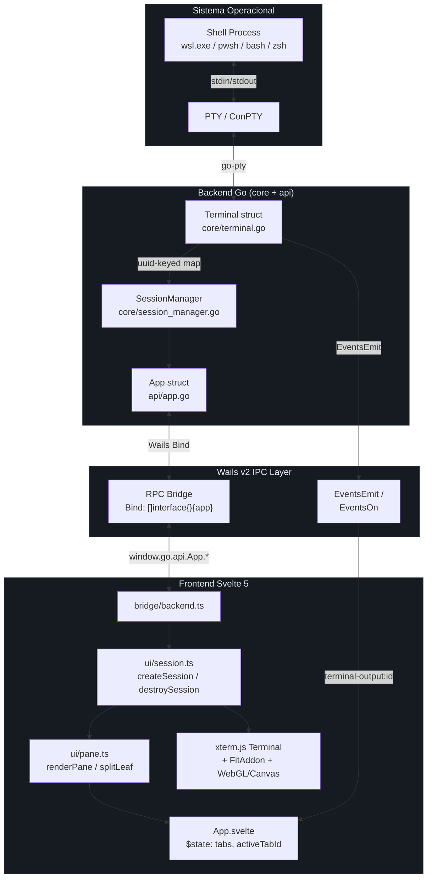
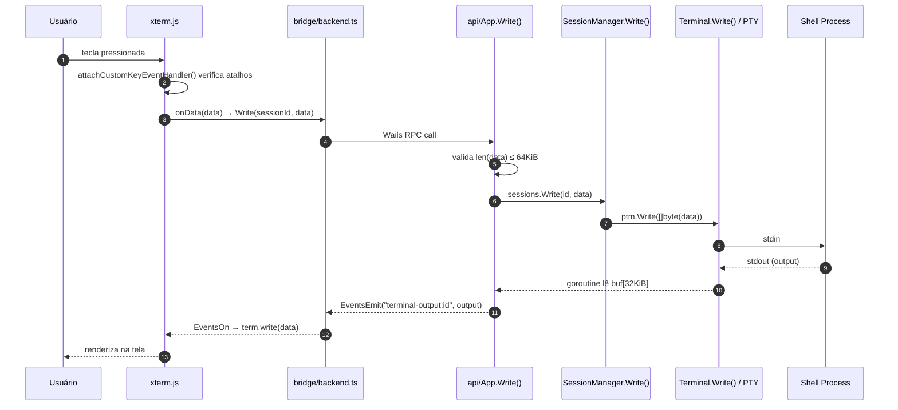
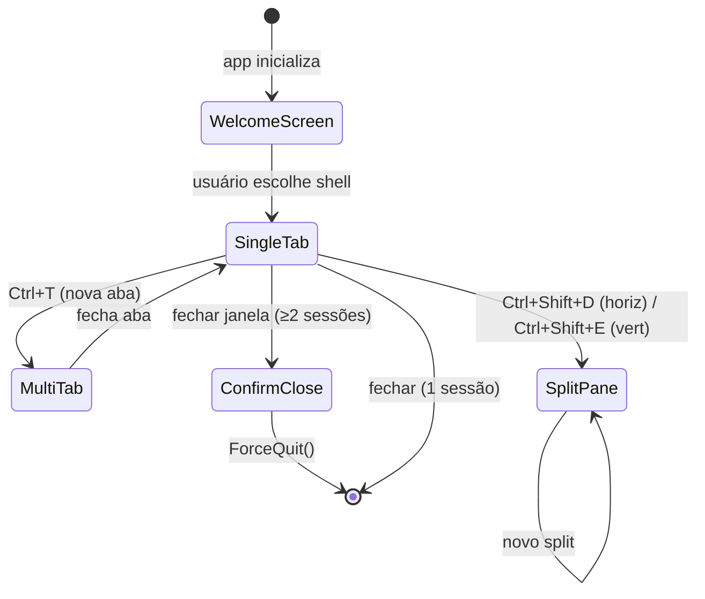

# Arquitetura do myTerm

O myTerm é um **aplicativo desktop híbrido**: o backend é um processo Go rodando em modo nativo, e o frontend é uma SPA Svelte renderizada dentro do WebView do sistema operacional. A comunicação entre os dois lados acontece exclusivamente via **Wails IPC** — chamadas RPC e eventos via WebSocket interno.

Por que essa escolha? Go oferece acesso direto a PTY (pseudoterminal) via ConPTY (Windows) ou `/dev/ptmx` (Unix), algo impossível de se fazer em JavaScript puro. Svelte oferece reatividade eficiente sem o overhead de um framework completo.

## Visão Geral em Diagrama

## Camadas e Responsabilidades

| Camada | Pacote / Arquivo | Responsabilidade |
|---|---|---|
| Entry point | `main.go` | Configura `wails.Run` com opções de plataforma |
| API layer | `api/app.go` | Único struct exposto ao Wails; valida e delega |
| PTY | `core/terminal.go` | Abre PTY, lê output, faz write/resize |
| Session registry | `core/session_manager.go` | Mapa `UUID → *Terminal` com RWMutex |
| Shell detection | `core/shells.go` | Detecta shells por plataforma |
| IPC bridge (TS) | `frontend/src/bridge/` | Re-exporta bindings Wails gerados |
| Domain types | `frontend/src/domain/` | Tipos TS, settings, font-loader |
| UI logic | `frontend/src/ui/` | Session lifecycle, pane tree, GPU renderer |
| UI components | `frontend/src/` | App.svelte, TabBar, WelcomeScreen, etc. |
| Website | `website/` | SvelteKit landing page + download dinâmico |

## Fluxo de Dados: Keystroke → PTY → Display

## Gestão de Sessões e Tabs

Cada **tab** contém uma árvore de nós (`PaneNode`), que pode ser:

- `PaneLeaf` — uma sessão PTY única com seu `Terminal` xterm.js
- `PaneSplit` — divisão horizontal ou vertical de dois sub-nós, com `ratio` (0.0–1.0)

A árvore é imutável por função — operações como `splitLeaf` e `removeLeaf` retornam uma nova raiz, preservando referências a nós inalterados (`frontend/src/ui/pane.ts:204`).

## Fluxo de Encerramento

Fechar a janela com 2+ sessões ativas aciona um protocolo de dois passos (`api/app.go:124-145`):

1. `ConfirmClose()` — emite evento `confirm-close` para o frontend e retorna `true` (previne fechamento imediato)
2. Frontend exibe modal de confirmação
3. Usuário confirma → `ForceQuit()` seta `forceQuit` atomicamente → `runtime.Quit()`
4. Wails chama `ConfirmClose()` novamente (comportamento interno) → `forceQuit.Load()` retorna `false` → janela fecha

A flag `atomic.Bool` evita condição de corrida entre a goroutine do Wails e a chamada RPC do frontend.

## Atualização Automática

`CheckForUpdates()` (`api/app.go:42`) consulta `https://api.github.com/repos/marcelomatz/myterm/releases/latest` com timeout de 5 segundos. Se `tag_name != CurrentVersion`, retorna `HasUpdate: true` com URL. O frontend exibe um toast via `ui/UpdateToast.svelte` sem bloquear o arranque.

## Multi-plataforma

| Plataforma | WebView | PTY | Shell padrão |
|---|---|---|---|
| Windows | WebView2 | ConPTY (`go-pty`) | wsl.exe → pwsh.exe → powershell.exe → cmd.exe |
| macOS | WKWebView | `/dev/ptmx` | `$SHELL` → zsh → bash |
| Linux | WebKit | `/dev/ptmx` | `$SHELL` → zsh → bash → sh |

Configurações de plataforma em `main.go:46-60`: Windows desativa ícone e pinch-zoom; macOS usa `TitleBarHiddenInset` com janela frameless.
